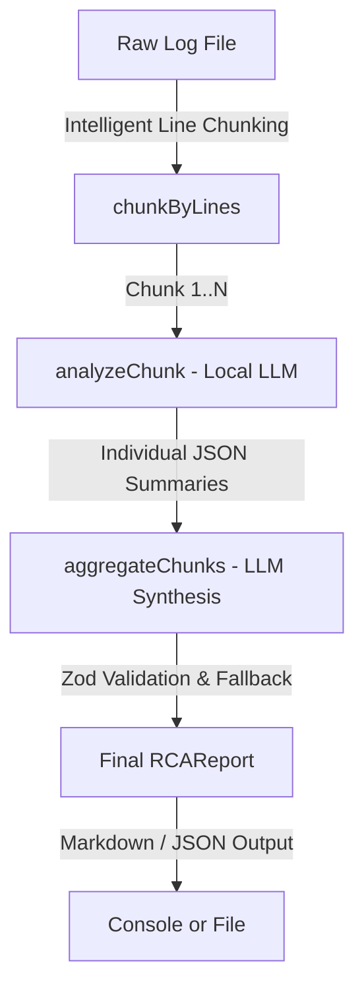

# 📝 Log Root Cause Analysis (RCA) CLI

An intelligent, AI-powered Site Reliability Engineering (SRE) command-line interface designed to ingest large log files, segment them into context-aware chunks, perform localized chunk analyses, and synthesize a comprehensive **Root Cause Analysis (RCA)** report.

Powered by modern TypeScript, Zod validation, and local LLMs (via Ollama).

---

## 🏗️ Architecture



## Overall Flow

```mermaid
graph LR
    A[Start] --> B[Read Logs (file or Loki)]
    B --> C[Detect Format & Normalize]
    C --> D[Chunk Logs]
    D --> E[Analyze Chunk (LLM)]
    E --> F[Aggregate Analyses]
    F --> G[Format Report]
    G --> H[Output (stdout/file)]
```

* **[src/cli.ts](file:///Users/manuelantoniorojasramos/Projects/log-rca/src/cli.ts)**: Orchestrates the pipeline, parses command-line arguments, and formats SRE outputs.
* **[src/chunker.ts](file:///Users/manuelantoniorojasramos/Projects/log-rca/src/chunker.ts)**: Splits large log files into safe line-based chunks optimized for LLM token windows.
* **[src/analyzer.ts](file:///Users/manuelantoniorojasramos/Projects/log-rca/src/analyzer.ts)**: Interacts with Ollama to analyze individual log segments and extract key SRE facts (error patterns, affected services, confidence score).
* **[src/aggregator.ts](file:///Users/manuelantoniorojasramos/Projects/log-rca/src/aggregator.ts)**: Merges localized summaries, reasons over chronological trends to build an incident timeline, deduplicates evidence, and produces a final validated report.
* **[src/types.ts](file:///Users/manuelantoniorojasramos/Projects/log-rca/src/types.ts)**: Strong TypeScript types for structured SRE records.
* **[docker-compose.yaml](file:///Users/manuelantoniorojasramos/Projects/log-rca/docker-compose.yaml)**: Provides a complete local observability stack (Loki, Grafana, Promtail) to ingest and view your application logs.

---

## 🛠️ Prerequisites

1. **Node.js**: `v18` or newer (ESM enabled).
2. **Ollama**: In-running local LLM server.
   * Pull the target SRE reasoning model (default is `qwen3` or `llama3`):
     ```bash
     ollama pull qwen3
     ```
3. **Docker**: For running Loki and Grafana observability stack (optional, for log ingestion).

---

## 🦙 Starting the Local Model (Ollama)

The CLI uses a local LLM to analyze and synthesize log data. You must have Ollama running locally. Follow these steps to set it up:

### 1. Download & Install Ollama
* **macOS / Windows**: Download the installer directly from [ollama.com](https://ollama.com).
* **Linux**: Run the following in your terminal:
  ```bash
  curl -fsSL https://ollama.com/install.sh | sh
  ```

### 2. Start the Ollama Service
Ensure the Ollama backend service is running:
* **macOS / Windows**: Open the **Ollama** application from your Applications folder or system tray.
* **Linux (systemd)**: The service usually starts automatically. If not, start it with:
  ```bash
  systemctl start ollama
  ```

### 3. Pull the Target LLM
Download your SRE reasoning model of choice (default is `qwen3`, but you can use others like `llama3` or `mistral`):
```bash
ollama pull qwen3
```

### 4. Verify the Local Server is Active
Ensure Ollama is running and responding on its default port (`11434`):
```bash
curl http://localhost:11434
```
*Expected response:* `Ollama is running`

---

## 🚀 Getting Started

### 1. Install Dependencies
Initialize package settings and download Node/TypeScript types:
```bash
npm install
```

### 2. Generate Incident Logs
Run the simulation script to generate a cascading distributed systems incident log (`DB pool exhaustion` $\rightarrow$ `Payment Service Failure` $\rightarrow$ `Cascading 503 errors` at `API Gateway`):
```bash
npm run generate-logs
```
*Creates a file at `./logs/app.log`.*

### 3. Run AI-Powered Analysis
Analyze `./logs/app.log` using the local model and print a beautifully formatted SRE Markdown report directly to your terminal:
```bash
npm run analyze -- --file ./logs/app.log
```

Or write the report directly to a file:
```bash
npm run analyze -- --file ./logs/app.log --output ./output/rca_report.md
```

Export structured JSON data for downstream automations:
```bash
npm run analyze -- --file ./logs/app.log --format json --output ./output/rca_report.json
```

---

## ⚙️ CLI Flags

| Flag | Description | Default | Example |
| :--- | :--- | :--- | :--- |
| `--file` | **(Required)** Path to the log file to analyze. | N/A | `--file ./logs/app.log` |
| `--format` | Output format: `markdown` or `json`. | `markdown` | `--format json` |
| `--model` | The local Ollama model to use. | `qwen3` | `--model llama3` |
| `--output` | Destination file path to write the output report. | Terminal stdout | `--output ./report.md` |

---

## 📊 Sample SRE Report Output

```markdown
# Root Cause Analysis (RCA) Report
**Generated At:** 5/30/2026, 1:10:00 AM
**Source File:** `./logs/app.log`
**Total Lines:** 209 | **Chunks Analyzed:** 2

## Executive Summary
* **Overall Severity:** CRITICAL
* **Confidence Score:** 95%
* **Affected Services:** `api-gateway`, `payment-service`, `db-proxy`, `auth-service`

### Root Cause
> Database proxy connection pool exhaustion at max capacity (50/50), causing transactional timeouts and cascading service failures down to the payment and authentication systems.

---

## Timeline of Events
- **2026-05-30T06:36:02.000Z**: ERROR db-proxy - Connection pool exhausted: max=50 active=50 waiting=23
- **2026-05-30T06:36:03.000Z**: WARN db-proxy - Connection wait time exceeded threshold: 5000ms
- **2026-05-30T06:36:04.000Z**: ERROR payment-service - Failed to acquire DB connection after 3 retries
- **2026-05-30T06:36:06.000Z**: ERROR api-gateway - Upstream payment-service returned 503

---

## Key Evidence & Log Context
```
2026-05-30T06:36:02.000Z ERROR db-proxy - Connection pool exhausted: max=50 active=50 waiting=23
2026-05-30T06:36:04.000Z ERROR payment-service - Failed to acquire DB connection after 3 retries
```

---

## Recommended Mitigation Actions
- [ ] Scale up the database proxy pool size to support additional connection limits.
- [ ] Implement short-circuit fallback behavior or queue management in the payment-service.
- [ ] Configure alert monitors on db-proxy connection wait times.
```

---

## 🐳 Observability Stack (Loki + Promtail + Grafana)

If you wish to visualize these logs inside Grafana:

1. **Start the containers**:
   ```bash
   docker compose up -d
   ```
2. **Promtail Ingestion**: Promtail will automatically start watching `./logs/*.log` and shipping them to Loki.
3. **Explore Logs**: Open **Grafana** at `http://localhost:3000` (default login is `admin` / `admin`). Loki is already pre-provisioned as the default datasource. Head to **Explore** and search your logs with LogQL!
